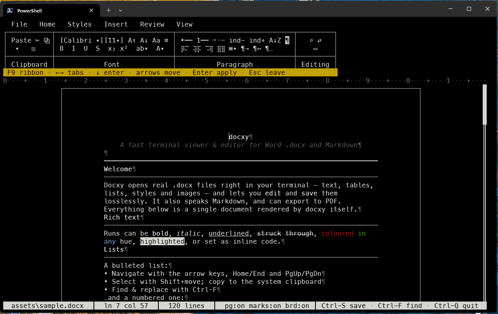

# Docxy

[](https://github.com/yeroo/docxy/actions/workflows/ci.yml)
[](https://scorecard.dev/viewer/?uri=github.com/yeroo/docxy)
[](https://crates.io/crates/docxy)
[](LICENSE)

**A fast terminal (TUI) viewer and editor for Microsoft Word `.docx` and Markdown — right where you live, in the terminal.**

Docxy opens real `.docx` files — text, tables, lists, styles, even images —
renders them faithfully in a character grid, and lets you **edit and save** them
losslessly. It reads and writes **Markdown** too, converts between the two, and
exports to **PDF**. No Office, no browser, no network: it's a single static
binary on top of a small, dependency-free OOXML engine.

<p align="center">
  
</p>

> Docxy deliberately doesn't reproduce Word's pixel-perfect layout — it renders a
> faithful, readable view of the document in a character grid, with a familiar
> ribbon, mouse support, and an optional Vim mode.

## Why docxy?

- **Stay in the terminal.** Read and edit Word documents over SSH, in tmux, or
  from your editor's shell — no GUI required.
- **Lossless by design.** Anything docxy doesn't model (bookmarks, fields,
  content controls, section properties) is preserved byte-for-faithful on save.
- **Zero-dependency core.** The `docxcore` crate is pure `std` — its own
  ZIP/DEFLATE, XML parser, renderer, and PDF writer — so it's auditable and
  trivially embeddable.
- **One file does it all.** `.docx` ⇄ `.md` conversion and `.docx → .pdf` export
  are built in, scriptable, and headless.

## Quick start

```sh
cargo install docxy          # or grab a prebuilt binary (see Install)

docxy report.docx            # open a Word document
docxy notes.md               # open / edit Markdown
docxy                        # launch the welcome screen (new file or open)
```

Want to see it immediately? Generate the showcase document and open it:

```sh
cargo run -p docxcore --example gen_sample   # writes assets/sample.docx
docxy assets/sample.docx
```

## Features

### Documents & editing
- **View & edit** paragraphs and runs (bold / italic / underline / strike /
  color / highlight / sub- & superscript) and **tables**, including merged
  cells — navigate and type directly into cells.
- **Styles** resolved from `styles.xml`; **lists** numbered from `numbering.xml`;
  headings, indents, alignment, tab stops, and horizontal rules.
- **Lossless save** — unmodeled parts are preserved exactly.
- **Find & replace**, full **clipboard** (syncs with the OS clipboard),
  **selection + formatting**, word navigation, and **show-invisibles**.
- **Headers & footers**, multi-section page layout, and **print/page view**.

### Markdown
- Open and edit `.md` files directly; **Save As** to a `.md` or `.docx` name
  converts between the two.
- **View ▸ Markdown** toggles a `.md` file between the rendered document and its
  raw source.
- Headings, **bold/italic/strike**, inline `code`, fenced code blocks,
  blockquotes, links, bullet/ordered lists, thematic rules, and pipe tables all
  map across — and round-trip through `.docx` via real Word styles.
- **Scientific formulas**: `$…$` inline and `$$…$$` display math (LaTeX) convert
  to and from native Word equations (OMML) — fractions, roots, `\sum`/`\int`
  with limits, Greek, scripts, `\left…\right`, and named functions.
- **Mermaid diagrams**: a ```` ```mermaid ```` block becomes a native Word
  drawing (DrawingML shapes + connectors, laid out automatically); the Mermaid
  source is embedded so Word → Markdown restores the exact block. Flowcharts are
  laid out fully; other diagram types are best-effort.

### Images
- Raster (PNG / JPEG / GIF / BMP / TIFF) rendered as **real pixels** via
  kitty / iTerm2 / **Sixel** graphics.
- Legacy **WMF/EMF vector** images rasterized through the OS (Windows).
- Floating, frame-anchored images projected to their real page positions.

### Niceties
- **Welcome screen** on launch with no file: create a `.docx`/`.md` or open one —
  keyboard- and mouse-driven.
- **Mouse** everywhere: click to move, click a link to open, wheel/drag to
  scroll/select, and a fully clickable ribbon and File menu.
- Safe **clickable links** — only `http(s)`, shown for confirmation, opened
  without a shell.
- **Vim mode** (`--vim`): motions, operators, visual mode, `/` search, `:w`/`:q`.
- **PDF export**, including headless.

## Usage

```sh
docxy <file.docx|.md>           # open a Word or Markdown file
docxy                           # welcome screen (new .docx/.md, or open)
docxy <file> --vim              # open with Vim keybindings

# Headless conversion / export (no UI):
docxy in.docx  --pdf  out.pdf   # export to PDF
docxy in.docx  --md   out.md    # convert Word → Markdown
docxy in.md    --docx out.docx  # convert Markdown → Word
```

### Keys

| Keys | Action |
|------|--------|
| type · Enter · Backspace · Delete | edit text |
| arrows · Home/End · PgUp/PgDn | move (Ctrl-←/→ by word) |
| Shift + move | select (Esc clears) |
| Ctrl-B / Ctrl-I / Ctrl-U | bold / italic / underline (over selection) |
| Ctrl-L / Ctrl-E / Ctrl-R | align left / center / right |
| Ctrl-A · Ctrl-C · Ctrl-X · Ctrl-V | select all · copy · cut · paste |
| Ctrl-F | find / replace (Tab toggles replace, Ctrl-A replaces all) |
| Ctrl-S · Ctrl-Z · Ctrl-Y | save · undo · redo |
| Ctrl-Q / Esc | quit |
| F2 · F3 · F4 | page view · show marks · table borders |
| F6 · F7 | edit header · edit footer (Esc returns) |
| F8 · F9 | insert landscape · portrait section at cursor |
| mouse | click to move · click a link to open · wheel/drag to scroll/select |

## Xlsxy — spreadsheets too

The workspace now ships a sibling app: **`xlsxy`**, a terminal editor for
Microsoft Excel `.xlsx` workbooks built on `gridcore`, a dependency-free
SpreadsheetML engine with a real **recalculation engine** — a dependency
graph over your formulas, ~170 Excel functions, Excel-faithful semantics
(error values, coercions, the 1900 leap-year quirk), whole-column
references, defined names, structured table references, 3D sheet spans,
`INDIRECT`/`OFFSET`, `XLOOKUP` and the `*IFS` family, the full
number-format runtime, **dynamic arrays** (`FILTER`/`SORT`/`UNIQUE`/
`SEQUENCE` spill into neighboring cells, `A1#` spill references, `@`,
`LET`, `#SPILL!` blocking and recovery), **`LAMBDA`** (custom functions via
defined names, `MAP`/`REDUCE`/`SCAN`/`BYROW`/`BYCOL`/`MAKEARRAY`,
elementwise lifting like `ABS(A1:A3)`), **pivot-table refresh and editing** (a
columnar group-by/aggregate engine recomputes pivots from current data —
`F9` in the TUI, automatic under `--recalc`; `Ctrl-P` opens a field editor
to rearrange rows/columns/values and aggregations), a **data model**
(`gridcore::model`: multiple tables with relationships and Excel-formula
measures, filter context through star schemas, CSV sources — `xlsxy
data.csv` imports directly; `Ctrl-M` manages the model in the TUI and
materializes reports, with definitions persisted in the file), and the
same lossless
round-trip guarantee: anything it doesn't model (charts, pivots, conditional
formatting…) is preserved byte-for-byte. Formulas it can't evaluate yet keep
Excel's cached results and are saved untouched.

```sh
xlsxy book.xlsx                   # open a workbook (grid, formula bar, tabs)
xlsxy in.xlsx --recalc out.xlsx   # headless: recalculate everything, save
xlsxy in.xlsx --csv out.csv       # headless: export the first sheet as CSV
xlsxy corpus/xlsx/*.xlsx --verify # conformance scoreboard: recalc + diff
                                  # against cached values (461/461 = 100%
                                  # on the LibreOffice-oracle corpus)
```

Type to replace, `F2` to edit, `=` starts a formula; copy/paste and
fill-down translate relative references like Excel; insert/delete rows and
columns rewrites every affected formula workbook-wide; find, Save As, and
sheet add/rename/delete round out the basics; range selections show
Sum/Average/Count in the status bar. Try it: `cargo run -p gridcore --example gen_sample_xlsx &&
xlsxy assets/sample.xlsx`. The design and roadmap (conformance scoreboard,
dynamic arrays, pivot engine) live in [SPREADSHEET.md](SPREADSHEET.md).

## Install

```sh
cargo install docxy   # the document editor
cargo install xlsxy   # the spreadsheet editor
```

Or grab prebuilt binaries (Linux / Windows / macOS) from the
[latest release](https://github.com/yeroo/docxy/releases/latest) — both apps
ship with every release, each checksummed, cosign-signed, and carrying a
build-provenance attestation.

## Image support

Real image pixels need a graphics-capable terminal:

- **WezTerm** (kitty + Sixel + iTerm2) — best.
- **Windows Terminal ≥ 1.22** (Sixel).
- Most other terminals fall back to a labeled placeholder box.

WMF/EMF vector images are rasterized via the OS GDI on Windows; on other platforms
they show as boxes.

## Building from source

```sh
git clone https://github.com/yeroo/docxy
cd docxy
cargo build --release
cargo test
```

The workspace has five crates:

- **`opccore`** — pure, `std`-only OPC container plumbing (ZIP read/write,
  DEFLATE, XML pull parser) shared by both engines.
- **`docxcore`** — the WordprocessingML engine (document model, rendering,
  and the from-scratch PDF writer). No third-party dependencies.
- **`gridcore`** — the SpreadsheetML engine (workbook model, formula
  parser/evaluator, dependency-graph recalculation, lossless xlsx I/O).
- **`docxy`** — the document TUI (ratatui), clipboard (arboard), and image
  rendering (ratatui-image).
- **`xlsxy`** — the spreadsheet TUI (ratatui + arboard).

### Examples

```sh
cargo run -p docxcore --example gen_sample [out.docx]   # build the showcase doc
cargo run -p docxcore --example dump_doc -- assets/sample.docx   # inspect a .docx
cargo run -p gridcore --example gen_sample_xlsx   # build the showcase workbook
```

## License

MIT © yeroo
