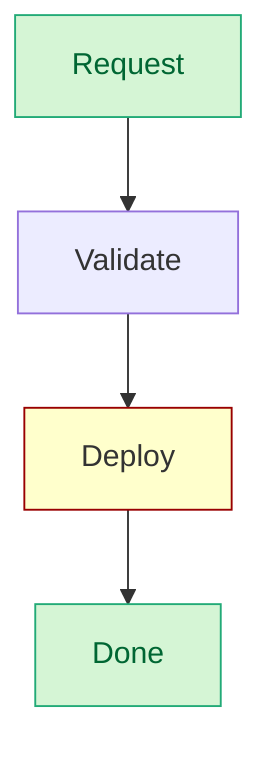

# Colors — classDef / style / inline :::

```mermaid
flowchart TD
  classDef ok fill:#d5f5d5,stroke:#22aa77,color:#063
  classDef warn fill:#ffffcc,stroke:#aa8800
  A[Request]:::ok --> B[Validate]
  B --> C[Deploy]:::warn
  style C stroke:#990000
  C --> D[Done]:::ok
```
