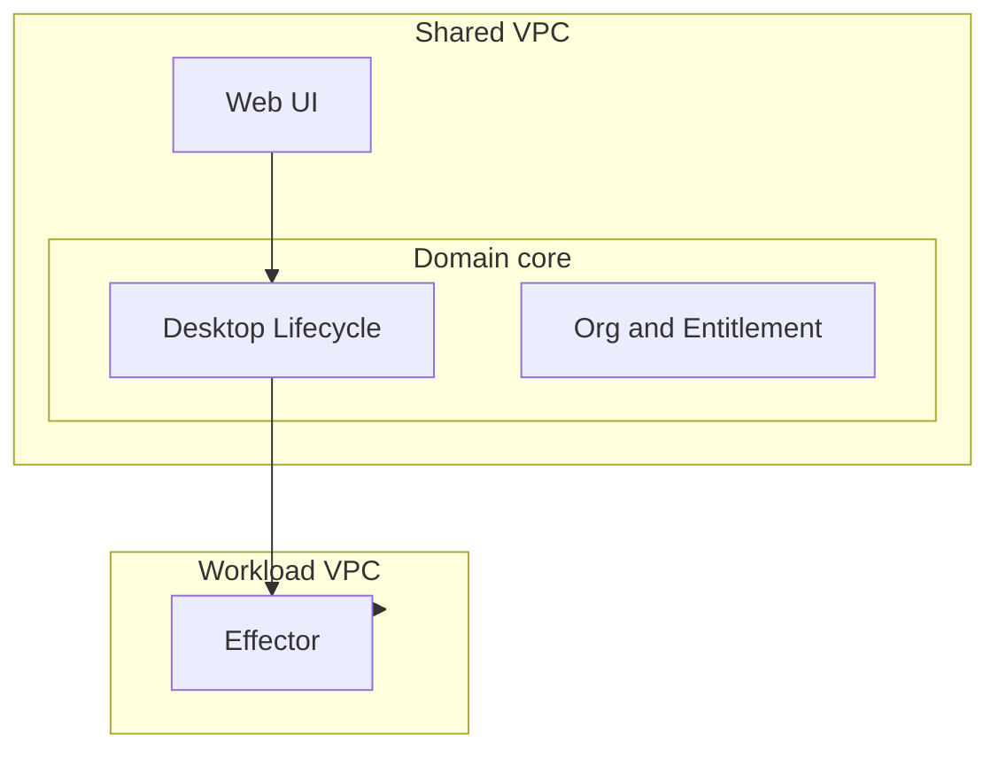

# Subgraphs — nested containers with titles

```mermaid
flowchart TB
  subgraph Shared[Shared VPC]
    UI[Web UI]
    subgraph Core[Domain core]
      DL[Desktop Lifecycle]
      OE[Org and Entitlement]
    end
  end
  subgraph Work[Workload VPC]
    EFF[Effector]
  end
  UI --> DL
  DL --> EFF
  EFF --> Work
```
