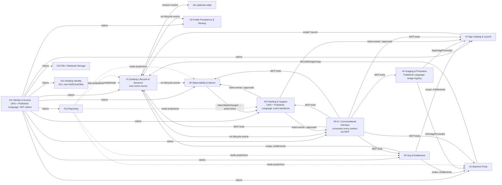

# Aliaksei VDI — context map (real-world source, graph LR)

Copied verbatim from `2026-07-20-vdi-domain-model-design.md` §6 "Context map" — exercises heavy fan-out edges (`A -->|label| B & C & D & ...`).

