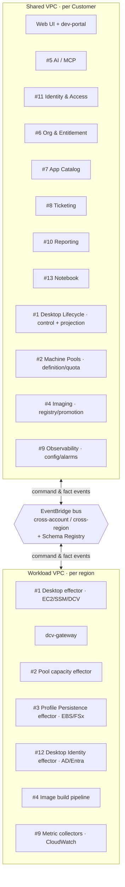

# Aliaksei VDI — deployment topology (real-world source, graph TB)

Copied verbatim from `2026-07-20-vdi-domain-model-design.md` §7 "Deployment topology" — exercises nested subgraphs plus a `{{hexagon}}` shape node.

