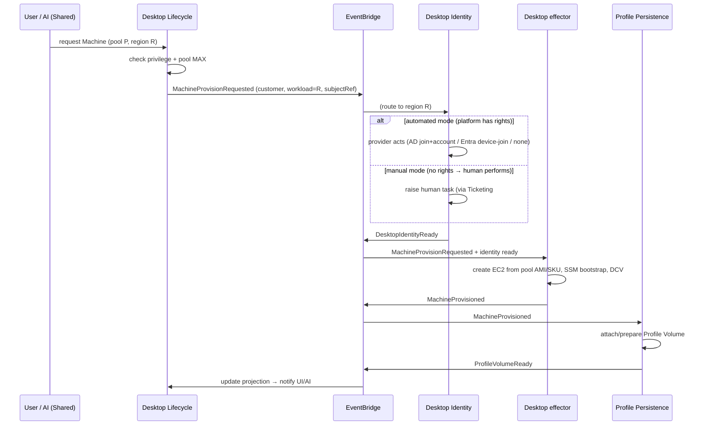

# Aliaksei VDI — provisioning choreography (real-world source, sequenceDiagram)

Copied verbatim from `2026-07-20-vdi-domain-model-design.md` §8 "Flagship choreography — provisioning" — exercises the sequence-diagram best-effort renderer.

